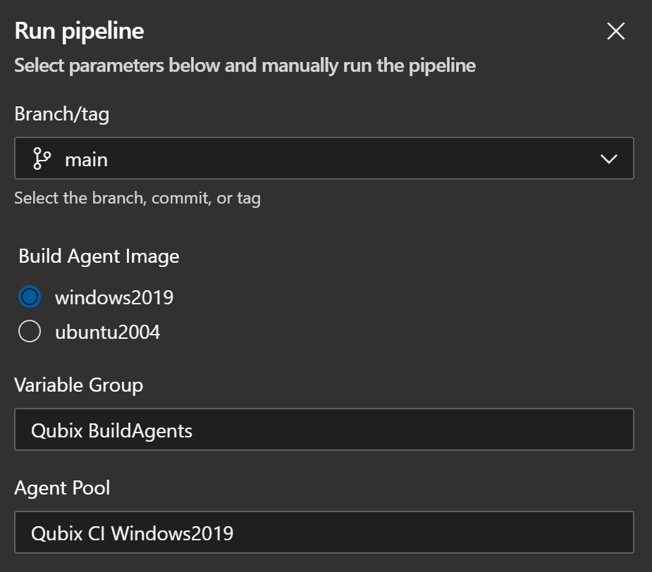
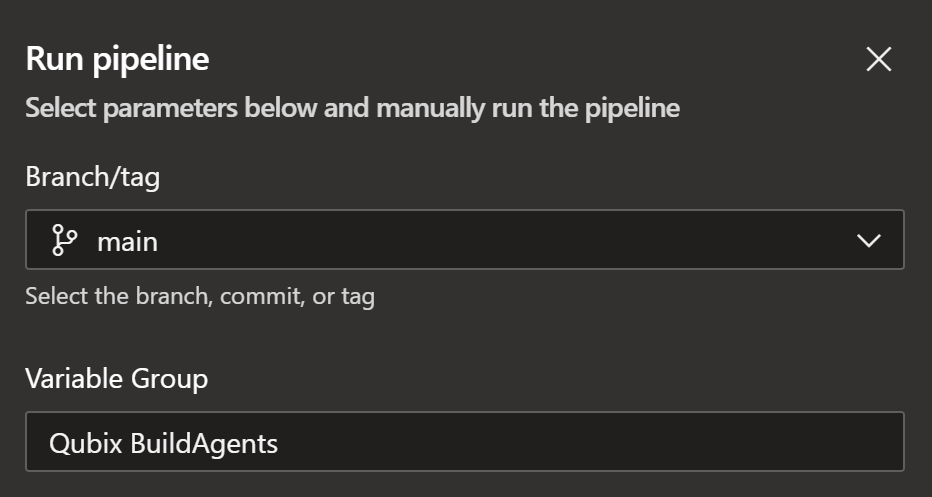

# DevOps Build Agents
This project generates self-hosted build agents based on the [official Microsoft-hosted build agents images](https://github.com/actions/runner-images), in an Azure DevOps Pipeline. The resulting Azure Managed Image will be add to an Azure Compute Gallery so that it can be used by a Virtual Machine Scale Set.  This Virtual Machine Scale Set is managed by Azure DevOps as a [Azure Virtual Machine Scale Set Agent](https://docs.microsoft.com/en-us/azure/devops/pipelines/agents/agents?view=azure-devops&tabs=browser&WT.mc_id=M365-MVP-5003400#azure-virtual-machine-scale-set-agents).

Currently supports Windows Server 2022, Windows Server 2025, Ubuntu 2204 and Ubuntu 2404 images.

## Available pipelines
- __[buildagent-generation.yml](./buildagent-generation.yml)__  
  - Checkout the latest `main` branch from [actions/runner-images](https://github.com/actions/runner-images)
  - Build the VM with Packer and add to Azure Compute Gallery  
  - Clean up remaining temporary Azure resources  
- __[managedimage-cleanup.yml](./managedimage-cleanup.yml)__  
  - Remove old Gallery image versions

## Preparation
The pipeline requires Azure resources for the temporary building of the VM image, Azure resources for running the resulting Agent Pool, and some configuration in Azure DevOps.

## Azure Compute Gallery
Create (if you don´t have one) an Azure Compute Gallery in your Azure subscription, and create the following VM Image Definitions:
- ubuntu2204-agentpool-full (OS: Linux)
- ubuntu2404-agentpool-full (OS: Linux)
- windows2022-agentpool-full (OS: Windows)  
- windows2025-agentpool-full (OS: Windows)  

### Azure Resources for Packer execution
The Azure resources are created with the [Azure PowerShell Module](https://docs.microsoft.com/en-us/powershell/azure/new-azureps-module-az?WT.mc_id=M365-MVP-5003400)  

1. Connect to Azure
```
Connect-AzAccount -UseDeviceAuthentication
```
2. Create resource group that will store the Packer temporary resources
```
New-AzResourceGroup -Name "DevOps-PackerResources" -Location "West Europe"
```
3. Create Azure AD Service Principal, output client secret and client id
```
$sp = New-AzADServicePrincipal -DisplayName "DevOps-Packer"
$BSTR = [System.Runtime.InteropServices.Marshal]::SecureStringToBSTR($sp.Secret)
$plainPassword = [System.Runtime.InteropServices.Marshal]::PtrToStringAuto($BSTR)
$plainPassword
$sp.ApplicationId
```
4. Make the Service Principal a Contributor on the subscription
```
New-AzRoleAssignment -RoleDefinitionName Contributor -ServicePrincipalName $sp.ApplicationId
```

### Azure Virtual Machine Scale Set
To use an Azure Virtual Machine Scale Set as an Azure DevOps Scale Set Agent it has to adhere to a certain set of requirements. [The documentation](https://docs.microsoft.com/en-us/azure/devops/pipelines/agents/scale-set-agents?view=azure-devops&WT.mc_id=M365-MVP-5003400#create-the-scale-set) contains all the required information, but at the time of writing the following things were important:
- __VM size__: at least *Standard_D4s_v4*
- __Overprovisioning__: *no*, Azure DevOps will decide whether or not new VM's (and thus Agents) need to be provisioned
- __Upgrade policy__: *manual*

### Azure DevOps Scale Set Agent
The Virtual Machine Scale Set from the previous step needs to be registered as an Agent Pool in Azure DevOps. [The instructions are very clear](https://docs.microsoft.com/en-us/azure/devops/pipelines/agents/scale-set-agents?view=azure-devops&WT.mc_id=M365-MVP-5003400#create-the-scale-set-agent-pool):
- Add an Agent Pool of type "Azure virtual machine scale set"  
- Use a service connection to select the scale set from the previous step (only supported via `Secret` authentication, not `Certificate` or `Managed Identity` authentication)  
- Give the agent pool a name  
- Enter the required configuration values  

### Azure DevOps Variable Group
Create a Variable Group in the Azure DevOps project running the pipeline, and give it a name. It needs to contain the following variables with their appropriate value:
| Variable  | Description |
|---|---|
| DOBA-LOCATION | Azure location where Packer will create the temporary resources |
| DOBA-RESOURCE-GROUP | Resource group that will be used by Packer to put the resulting Azure Managed Image. |
| DOBA-SUBSCRIPTION-ID | Subscription ID of the Azure Subscription that is used to host the temporary resources. |
| DOBA-TENANT-ID | Tenant ID of the Azure tenant that has the Azure Resource Groups and Subscription. |
| DOBA-CLIENT-ID | Id of the Azure AD application that has appropriate permissions on the Subscription to create temporary resources and finalizing the Scale Set configuration. See output from scripts above. |
| DOBA-CLIENT-SECRET | Application secret to be used fot the connection in combination with the Client Id. See output from scripts above. |
| DOBA-GALLERY-NAME | Name of the Azure Compute Gallery to store images for Agent Pool VM Scale Sets. |
| DOBA-GALLERY-RESOURCE-GROUP | Name of the resource group containing the Azure Compute Gallery. | 
| DOBA-GALLERY-STORAGE-ACCOUNT-TYPE | Storage account type used to storage Gallery Image Versions. Accepted values: Standard_LRS, Premium_LRS, Standard_ZRS | 

If you want to use your own existing Virtual Network for the temporary VM, add the following variables:
| Variable  | Description |
|---|---|
| DOBA-VNET-NAME | Name of the existing VNet to use for the VM created by Packer |
| DOBA-VNET-RESOURCE-GROUP | Name of the resource group containing the existing VNet to use for the VM created by Packer |
| DOBA-VNET-SUBNET | Name of the existing subnet to use for the VM created by Packer |

## Pipeline runtime parameters
### Build Agent Generation
  

- __Build Agent Image__: which image to build  
- __runner-images Version__: which source code of the runner-images to build, choice between `alpha` (latest main branch), `prerelease` (latest prerelease version), and `release` (latest stable release)  
- __Variable Group__: name of the Variable Group containing the variables necessary for execution
- __Agent Pool__: the Agent Pool to use for running the pipeline

### Managed Image Cleanup


- __Variable Group__: name of the Variable Group containing the variables necessary for execution

## How to use
### Templated version
Both YML file are designed in a way that allows anyone to simply include them using the "template" instruction. You will need to create a service connection under your Azure DevOps instance before moving with the configuration. 

Assuming the service connection has been setup, under your own repository, within an Azure Pipeline YML file, include the following resource: 

```
resources:
  repositories:
    - repository: azuredevops-buildagents
      type: github
      name: YannickRe/azuredevops-buildagents
      endpoint: <your-service-connection-name>
      ref: refs/heads/main
```

This will tell your pipeline that you're dependent upon this repository. Then, the following instructions can be freely customized to your needs. If you need some stages to be ran before the steps within this repository, then include them inside your pipeline, then call the desired template from the repository. 

Calling a template is easy as doing the following: 

```
stages:
  - stage: InsertAnyCustomStageHere
    displayName: 'My Stage'
    [...]
  - stage: BuildImage
    displayName: Build Image
    pool:
      name: <agent-pool>
    jobs:
    - template: buildagent-generation-template.yml@azuredevops-buildagents
      parameters: 
        image_type: <image-type>
        runner_images_version: <runner_images_version>
        variable_group: <variable-group>
        agent_pool: <agent-pool>
        repository_base_path: <repository_base_path>
```

### Template parameters
When calling a template, you must provide certain parameters. For reference, please open the file which interests you: 

- __[buildagent-generation.yml](./buildagent-generation.yml)__  
- __[managedimage-cleanup.yml](./managedimage-cleanup.yml)__  

There is one important element you must be aware of: 

- repository_base_path
  - This variable dictates how the agent should resolve the assets within this repository. When used, two things will happen:
    - First, it will clone the repository resource specified within your YML file, which represents _this_ repository
    - It will also use it to properly resolve the path where this repository resides on your pipeline agent
  - When a remote template is referenced within an Azure Pipeline YML file, it doesn't clone the repository. Providing this parameter will make sure these templates understands they need to clone it before being able to run any of the scripts.

Optional parameter:

- depends_on
  - You can force the jobs within this repository to depend upon your own set of tasks. To use it, simply provide the name of the job which the next job within the template should depend on.

The rest is quite self explanatory. Use the other parameters to provide the remaining required details for building / cleaning the images.

## Good to know
### Agent Pool Usage
See documentation for [YAML-based pipelines](https://docs.microsoft.com/en-us/azure/devops/pipelines/agents/pools-queues?view=azure-devops&tabs=yaml%2cbrowser&WT.mc_id=M365-MVP-5003400#choosing-a-pool-and-agent-in-your-pipeline) and [Classic pipelines](https://docs.microsoft.com/en-us/azure/devops/pipelines/agents/pools-queues?view=azure-devops&tabs=classic%2cbrowser&WT.mc_id=M365-MVP-5003400#choosing-a-pool-and-agent-in-your-pipeline)

### Azure CLI access denied error on Windows Host Pool
Please make sure to disable the "Configure VMs to run interactive tests" in your Windows Agent pool setting, otherwise the Azure CLI will generate access denied errors when running a pipeline.

## Version notes
### 5.0.0 - breaking change
* Removed support for directly updating a VMSS with a new image. This version only supports Azure Compute Gallery.  
* Switched to packer native support for updating an Azure Compute Gallery with a new version of an image.  
* Removed unused variables.  
* Renamed variables with main goal to avoid overlap with runner-images environment variable declaration, using `DOBA` as a prefix (stands for **D**ev**O**ps **B**uild **A**gents). This also solves #76 by switching from `_` to `-`  
  * Rename `AZURE_LOCATION` to `DOBA-LOCATION`  
  * Rename `AZURE_RESOURCE_GROUP` to `DOBA-RESOURCE-GROUP`  
  * Rename `AZURE_SUBSCRIPTION` to `DOBA-SUBSCRIPTION-ID`  
  * Rename `AZURE_TENANT` to `DOBA-TENANT-ID`  
  * Rename `CLIENT_ID` to `DOBA-CLIENT-ID`  
  * Rename `CLIENT_SECRET` to `DOBA-CLIENT-SECRET`  
  * Rename `SHARED_GALLERY_NAME` to `DOBA-GALLERY-NAME`  
  * Rename `SHARED_GALLERY_RESOURCE_GROUP` to `DOBA-GALLERY-RESOURCE-GROUP`  
  * Rename `SHARED_GALLERY_STORAGE_ACCOUNT_TYPE` to `DOBA-GALLERY-STORAGE-ACCOUNT-TYPE`  
  * Remove `AZURE_AGENTS_RESOURCE_GROUP`
  * Remove `RUN_VALIDATION_FLAG`
  * Remove `VMSS_Windows2022`
  * Remove `VMSS_Windows2025`
  * Remove `VMSS_Ubuntu2204`
  * Remove `VMSS_Ubuntu2404`
* If you use your own existing Virtual Network for creating the temporary VM, you have to rename those variables too. If you don't use this (current value is set to `$null`), you can now remove these variables.  
  * Rename `BUILD_AGENT_VNET_NAME` to `DOBA-VNET-NAME`  
  * Rename `BUILD_AGENT_VNET_RESOURCE_GROUP` to `DOBA-VNET-RESOURCE-GROUP`  
  * Rename `BUILD_AGENT_SUBNET_NAME` to `DOBA-VNET-SUBNET` 

### 4.0.0
* Fixed image generation after breaking changes from Microsoft
* This is the last version (normally) to support Managed Images directly on a VMSS. We will move towards the native support for Azure Compute Gallery updating that exists in packer and the source repository.  

### 3.0.0
* Rename all `GALLERY_*` variables to be `SHARED_GALLERY_*` to not conflict with new features coming in the templates by Microsoft.
* Removed support for Ubuntu 20.04 and Windows Server 2019
* Added support for Windows Server 2025